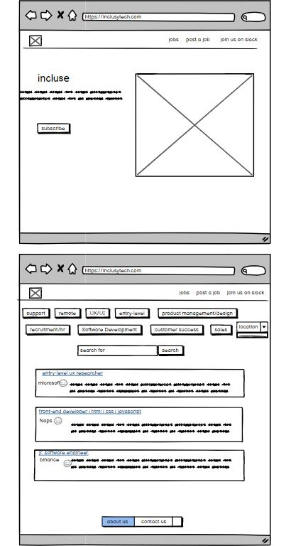

# Jobsboard

**User stories
---------------------------------------------------------
- **As a user, I want to easily identify links that I can click on to direct me to important parts of the website.**
- **As a user, I want to search for a job, so I can advance my career or change careers.**
- **As a user, I want to be able to search for relevant job opportunities based on my search criteria, to target specific careers in locations I'm interested**
- **As a user, I want to be able to see a list of job opportunities on the front page, so that I can see what's available**

- **As a user, I want to be able to click the link to apply on the company website or learn more about the company**
**- As a user, I want to be able to post jobs, so that I can hire diverse talent for my company.**

**ERD
-----------------------------------------------------------

**Wireframe
-------------------------------------------------------------

**Tools and Technologies
-------------------------------------------------------------
